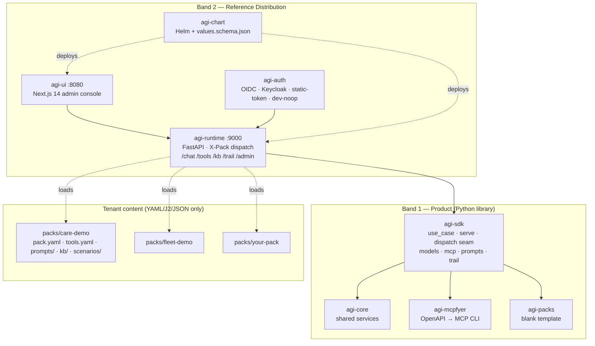

# project-agi

> **Vendor-neutral, configuration-driven agent framework — pip-installable SDK + optional reference runtime, UI, and Helm chart.** Built from scratch for the open world. Apache-2.0.

[](LICENSE)
[](https://www.python.org/downloads/)
[](#-status)
[](CHANGELOG.md)
[](CONTRIBUTING.md)

`project-agi` is an open-source toolkit for building **multi-tenant, claims-validated, MCP-first agent applications** in Python. The SDK is the product — `pip install agi-sdk` and you have everything needed to write a use case, expose it over HTTP/MCP, and run it against any LLM provider. Want to skip the wiring? The repo ships a reference runtime, admin console, and Helm chart that turn one or more packs into a deployable stack with one command.

---

## ✨ Why project-agi

- 🏷️ **Multi-tenant by YAML.** Drop a folder under `packs/`, get a new tenant. Every request carries an `X-Pack` header that is **claims-validated against the auth token** — no header-trust tenancy bypass.
- 🎭 **Roles, not providers.** Use-case code asks `sdk.models.binding("reasoning")` — never a model id. Swap OpenAI ↔ Anthropic ↔ Bedrock ↔ Ollama ↔ Together by editing one YAML. Lint blocks native LLM SDK imports.
- 🔌 **MCP-first tool plane.** Every tool is an MCP tool. Auto-generate MCP servers from any OpenAPI 3 spec via the bundled `agi-mcpfyer` CLI — Stripe, GitHub, Twilio, your internal microservice, anything.
- 🪶 **Plain async by default.** LangGraph and Pydantic-AI ship as **optional adapters**, not framework gravity. Use them when you need durable checkpointing or type-first ergonomics; skip them and write plain `async def` use cases that are 80 LOC end to end.
- 🛰️ **OpenLLMetry traced.** Auto-instrumentation at SDK import — every LLM call, every tool call, every orchestrator step lands as an OTel span. Pipe to Langfuse (default), Datadog, Honeycomb, or any OTLP collector.
- 🪧 **Library-first.** `pip install agi-sdk` works without any Band 2 component. The runtime is one supported distribution, not a mandatory carrier.
- 🆓 **Apache-2.0. Self-hosted. No SaaS lock-in.** No telemetry leaves your network unless you wire it up yourself.

---

## 🏗️ Architecture (two-band layout)

| Band | Purpose | Packages |
|------|---------|----------|
| **Band 1 — Product** | The library you embed | [`agi-sdk`](packages/agi-sdk), [`agi-core`](packages/agi-core), [`agi-mcpfyer`](packages/agi-mcpfyer), [`agi-packs`](packages/agi-packs) |
| **Band 2 — Reference Distribution** | Turnkey deployable | [`agi-runtime`](distribution/agi-runtime), [`agi-ui`](distribution/agi-ui), [`agi-auth`](distribution/agi-auth), [`agi-chart`](distribution/agi-chart) |

Band 2 depends on Band 1. **Band 1 never imports Band 2** — enforced by a CI isolation gate that AST-scans every SDK source file.



The full architecture walkthrough lives in [`docs/architecture.md`](docs/architecture.md).

---

## 🚀 Quick start

### Option 1 — Embed the SDK (library-first)

```bash
pip install agi-sdk
```

Write a use case in 40 lines:

```python
# bill_explainer.py
import litellm
from agi_sdk import use_case, serve

@use_case("bill_explainer", version="0.1.0")
class BillExplainer:
    def __init__(self, sdk):
        self.sdk       = sdk
        self.reasoning = sdk.models.binding("reasoning")
        self.billing   = sdk.mcp.tool("billing.get_invoice")

    async def handle(self, request, ctx):
        invoice = await self.billing.call(customer_id=request.customer_id)
        prompt  = self.sdk.prompts.get("explain_bill").render(invoice=invoice)
        reply   = await litellm.acompletion(
            messages=[{"role": "user", "content": prompt}],
            **self.reasoning.kwargs(),
        )
        return {"reply": reply.choices[0].message.content, "invoice_id": invoice["id"]}

if __name__ == "__main__":
    # http=True mounts /v1/invoke, /v1/tools, /v1/trail/{cid} on :9000
    # mcp=True  exposes the use case as an MCP tool surface
    serve(BillExplainer, http=True, mcp=True)
```

Run it:

```bash
export AGI_PACK_PATH=packs/care-demo
export OPENAI_API_KEY=sk-...        # any LiteLLM-supported provider
python bill_explainer.py
curl -X POST http://localhost:9000/v1/invoke \
  -H 'Content-Type: application/json' \
  -d '{"messages":[{"role":"user","content":"Why is my bill higher this month?"}]}'
```

See [`docs/use-cases/authoring.md`](docs/use-cases/authoring.md) for the full authoring tutorial.

### Option 2 — Run the reference stack (turnkey)

```bash
git clone https://github.com/margadeshaka/project-agi
cd project-agi
docker compose -f deploy/docker/docker-compose.yml up -d
open http://localhost:8080      # admin console
curl http://localhost:9000/healthz
```

You get:

| Service | Port | Purpose |
|---------|------|---------|
| `agi-runtime` | 9000 | FastAPI runtime with X-Pack dispatch + `/chat /tools /kb /trail /admin` |
| `agi-ui` | 8080 | Next.js admin console (Material Design 3) |
| `mongo` | 27017 | Runtime storage + AI-Trail sink |
| `qdrant` | 6333 | Vector store for pack KBs |
| `langfuse` | 3000 | OTLP ingestion + trace UI |
| `otel-collector` | 4317/4318 | OTel pipeline (gRPC + HTTP) |

For production, see [`docs/deploy/helm.md`](docs/deploy/helm.md) — the Helm chart at [`distribution/agi-chart`](distribution/agi-chart) deploys the same stack with HPA, NetworkPolicy, PDB, and a hardening-mode toggle for single-pack-per-pod tenants.

---

## 🧱 Concepts at a glance

| Concept | What it is | Read more |
|---------|------------|-----------|
| **Pack** | A folder containing `pack.yaml`, `tools.yaml`, `prompts/`, `kb/`, `scenarios/`. One tenant = one pack. | [`docs/packs/authoring.md`](docs/packs/authoring.md) |
| **Use case** | A Python class decorated with `@use_case(slug, version)` that owns one agentic flow. | [`docs/use-cases/authoring.md`](docs/use-cases/authoring.md) |
| **Dispatch seam** | `agi.dispatch.invoke_use_case` — the transport-agnostic seam both `serve()` and the runtime call. | [`docs/decisions/ADR-0002-serve-vs-runtime-dispatch.md`](docs/decisions/ADR-0002-serve-vs-runtime-dispatch.md) |
| **MCP tool** | Every tool is an MCP tool; auto-generate from any OpenAPI spec via `agi-mcpfyer`. | [`docs/tools/authoring.md`](docs/tools/authoring.md) |
| **AI-Trail** | Append-only audit log — OTel collector pipes spans into a regulator-grade schema. | [`docs/architecture.md`](docs/architecture.md) |
| **X-Pack header** | Per-request tenant id, **claims-validated** against the auth token. | [`docs/architecture.md`](docs/architecture.md) |
| **Orchestrators** | Plain async (default); LangGraph and Pydantic-AI as optional adapters. | [`ORCHESTRATOR_RESEARCH.md`](ORCHESTRATOR_RESEARCH.md) (historical) |

The full guided tour lives in [`docs/concepts.md`](docs/concepts.md).

---

## 📦 Installation

### From PyPI (recommended)

```bash
pip install agi-sdk                       # core SDK
pip install agi-sdk[langgraph]            # + LangGraph orchestrator adapter
pip install agi-sdk[pydantic-ai]          # + Pydantic-AI orchestrator adapter
pip install agi-sdk[mongo]                # + Motor (Mongo trail sink)
pip install agi-sdk[postgres]             # + asyncpg (Postgres trail sink)
pip install agi-sdk[qdrant]               # + Qdrant client (vector store)

pip install agi-mcpfyer                   # OpenAPI → MCP CLI
pip install agi-core                      # optional shared services
```

### From source (contributors)

```bash
git clone https://github.com/margadeshaka/project-agi
cd project-agi
uv sync --all-packages --all-extras       # ALWAYS pass --all-extras
uv run pytest -v
```

### Container images (GHCR)

```bash
docker pull ghcr.io/margadeshaka/agi-runtime:1.0.0-rc1
docker pull ghcr.io/margadeshaka/agi-ui:1.0.0-rc1
```

---

## 📚 Documentation

| Topic | Link |
|-------|------|
| Getting started tutorial | [`docs/deploy/getting-started.md`](docs/deploy/getting-started.md) |
| Concepts: packs, use cases, dispatch, MCP, AI-Trail | [`docs/concepts.md`](docs/concepts.md) |
| Architecture walkthrough | [`docs/architecture.md`](docs/architecture.md) |
| Authoring a pack | [`docs/packs/authoring.md`](docs/packs/authoring.md) |
| Authoring a use case | [`docs/use-cases/authoring.md`](docs/use-cases/authoring.md) |
| Authoring an MCP tool bundle | [`docs/tools/authoring.md`](docs/tools/authoring.md) |
| Helm deployment | [`docs/deploy/helm.md`](docs/deploy/helm.md) |
| Pack hotfix lane (≤15-min merge-to-live) | [`docs/deploy/hotfix.md`](docs/deploy/hotfix.md) |
| Migrating an existing pack | [`docs/packs/migration.md`](docs/packs/migration.md) |
| Architecture Decision Records | [`docs/decisions/`](docs/decisions/) |
| Changelog | [`CHANGELOG.md`](CHANGELOG.md) |

---

## 🎯 Reference packs

The repo ships two demonstrator packs (industry-neutral):

- **[`packs/care-demo`](packs/care-demo)** — customer-care agent with the Deflect → Resolve → Escalate ladder. Applies to any business that bills customers, activates accounts, processes plan changes, refunds, and escalates to a specialist team.
- **[`packs/fleet-demo`](packs/fleet-demo)** — logistics flavour: delivery-exception triage, route-incident explainer.

Plus a **blank template** at [`packages/agi-packs/blank`](packages/agi-packs/blank) — `cp -r` to bootstrap your own pack.

---

## 🔌 Integrations

| Layer | Default | Adapters |
|-------|---------|----------|
| **Model gateway** | [LiteLLM](https://github.com/BerriAI/litellm) (library mode) | OpenAI · Anthropic · Bedrock · Ollama · Together · Cohere · Groq · 100+ providers via LiteLLM |
| **Identity** | Keycloak (OIDC) | Generic OIDC · static-token · dev-noop |
| **Trace sink** | [Langfuse](https://langfuse.com) (OTLP) | Any OTLP-compatible collector (Datadog · Honeycomb · Jaeger · Grafana Tempo) |
| **Vector store** | [Qdrant](https://qdrant.tech) | pgvector · Mongo Atlas Search · Weaviate (planned) |
| **Storage** | SQLite (dev) | Mongo · Postgres |
| **Orchestrator** | Plain async (Pydantic state) | LangGraph · Pydantic-AI |
| **Auto-instrumentation** | [OpenLLMetry](https://github.com/traceloop/openllmetry) at SDK boot | Set `AGI_DISABLE_TRACELOOP=1` to opt out |

---

## 🧪 Status

**This is 1.0.0-rc1.** See [`CHANGELOG.md`](CHANGELOG.md) for the full release history.

| Phase | Scope | Status |
|-------|-------|--------|
| P0 | Public repo scaffold | ✅ Done |
| P1 + P1.5 | `agi-sdk` shell · dispatch seam · orchestrator adapters | ✅ Done |
| P2 | `agi-mcpfyer` (OpenAPI → MCP) | ✅ Done |
| P3 | `agi-runtime` + claims-validated X-Pack dispatch | ✅ Done |
| P4 | Admin UI (NextAuth v5 + Keycloak, tool catalogue, audit, KB SSE) | ✅ Done |
| P5 | Helm chart + GHCR publishing + `/chat` helm-test | ✅ Done in-repo; first green run + GHCR perms documented in [`docs/deploy/p5-runbook.md`](docs/deploy/p5-runbook.md) |
| **P6** | **v1.0 release prep — PyPI publish + docs polish + version freeze** | **🚧 In flight** |

Test counts: **129 Python tests · 71 TypeScript tests · ruff/mypy/format/isolation-gate all green.**

---

## 🛣️ Roadmap after v1.0

Deferred to v1.1 and beyond:

- **Multi-arch container images** — add `linux/arm64` to the GHCR publish matrix (blocked on LiteLLM wheel availability).
- **Image signing + provenance** — cosign signatures and SLSA attestations on every published image.
- **Helm OCI publish** — chart pushed to `oci://ghcr.io/margadeshaka/agi` alongside the container images.
- **Real Mongo / Postgres trail sink with live probe** — surfaces real health in `/admin/use-cases` (current sink defaults to in-memory + file-jsonl).
- **Eval harness wrapper depth** — ship a thin Promptfoo wrapper or document direct Promptfoo usage against the AI-Trail.
- **Streaming tool dispatch interleaving** — full SSE token streaming inside tool-calling loops.
- **Adapter modules** — Weaviate vector store, Mongo Atlas Search trail sink, additional OIDC providers.

---

## 🤝 Contributing

Contributions welcome from anyone — see [`CONTRIBUTING.md`](CONTRIBUTING.md) for the workflow. The project follows the [Contributor Covenant](CODE_OF_CONDUCT.md) code of conduct. For security disclosures, see [`SECURITY.md`](SECURITY.md).

Conventions in 30 seconds:

- **Python**: ruff + mypy strict, line length 100, py311/12/13.
- **Commits**: [Conventional Commits](https://www.conventionalcommits.org/).
- **Non-trivial changes**: write an ADR under [`docs/decisions/`](docs/decisions/).
- **Roles, not providers**: no `import openai/anthropic/boto3` in SDK code — enforced.
- **MCP-only tools**: no parallel tool abstractions.

---

## 📄 License

[Apache-2.0](LICENSE). © 2026 project-agi contributors.

---

## 🔎 Finding this project

If you arrived here from a search, the keywords that describe `project-agi`:

**agent framework** · **multi-agent** · **agentic AI** · **Model Context Protocol** · **MCP server** · **OpenAPI to MCP** · **LangGraph alternative** · **Pydantic-AI** · **LLM orchestration** · **OpenAI-agnostic** · **Anthropic-agnostic** · **multi-tenant agent platform** · **claims-validated dispatch** · **self-hosted GenAI** · **Apache-2.0 agent framework** · **LiteLLM** · **OpenLLMetry** · **Langfuse** · **Keycloak agent** · **FastAPI agent** · **Next.js admin console** · **Helm chart agent** · **agi-sdk** · **agi-runtime** · **agi-mcpfyer**
