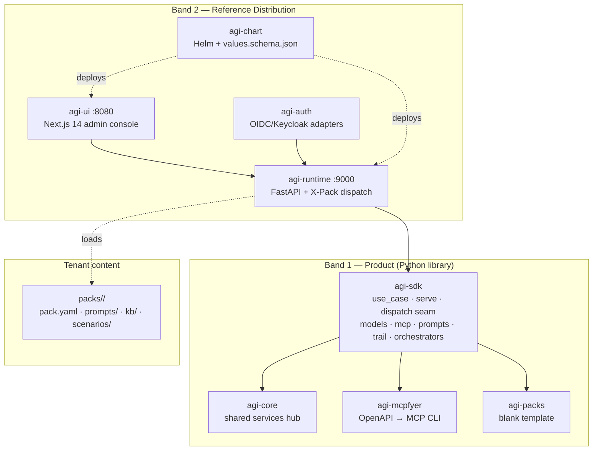
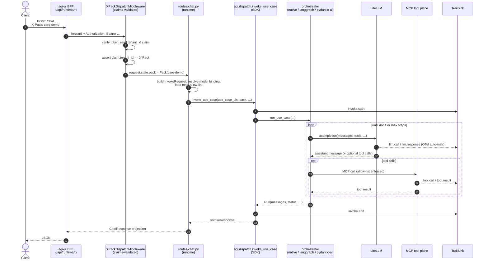
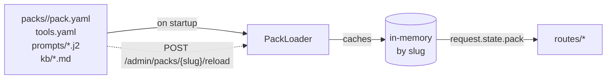
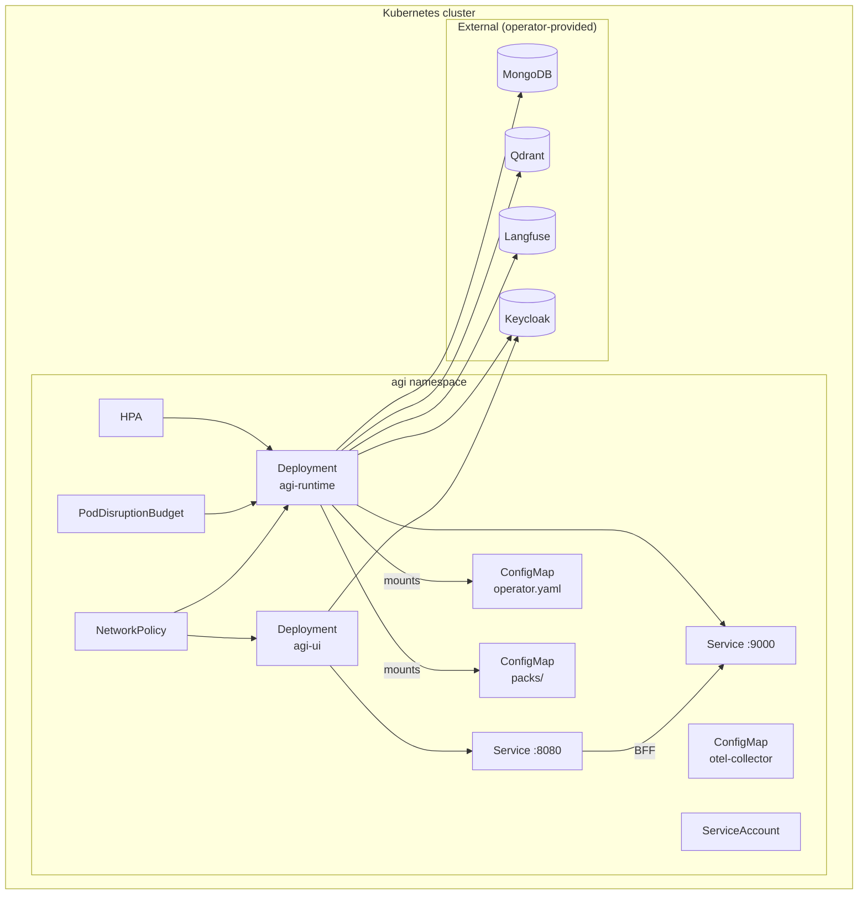

# Architecture

How `project-agi` actually works under the hood. This document is the
prose companion to [`docs/concepts.md`](concepts.md) — read concepts
first if any term here is unfamiliar.

---

## Two-band layout



**Band 1 (Product)** is what you `pip install`. It is pure Python — no
FastAPI, no React, no Docker, no Helm. Embed it in a Lambda, a CLI, a
Jupyter notebook, a Django app. The dependency graph stops at `pydantic`
+ `litellm` + `mcp` + `traceloop-sdk` + `httpx` + `jinja2`.

**Band 2 (Reference Distribution)** is the supported turnkey deployable.
A FastAPI runtime, a Next.js admin console, a Helm chart. It depends on
Band 1; Band 1 **never** depends on Band 2. The isolation gate
(`packages/agi-sdk/tests/test_isolation_gate.py`) AST-scans every SDK
source file and fails CI on any band-2 import.

---

## Request flow (runtime path)



The numbered hops:

1. The client hits the BFF, which is **part of the Next.js app**
   (`distribution/agi-ui/app/api/runtime/[...path]/route.ts`). The BFF
   knows about NextAuth session cookies and forwards an `Authorization:
   Bearer <accessToken>` to the runtime.
2. `XPackDispatchMiddleware` (`distribution/agi-runtime/agi_runtime/middleware/dispatch.py`)
   verifies the bearer via the active `agi-auth` adapter, decodes
   `tenant_id` from the token claims, and **asserts it matches the
   `X-Pack` header**. Mismatch → 401. This is the multi-tenant boundary.
3. Once cleared, the middleware attaches `request.state.pack`,
   `request.state.claims`, `request.state.correlation_id`, and the
   request reaches the route handler.
4. `routes/chat.py` (Band 2) builds an `InvokeRequest`, resolves the
   `ModelBinding` from operator config + pack overrides, and loads the
   pack's allow-listed tools.
5. The route calls the **dispatch seam** —
   `agi.dispatch.invoke_use_case(...)` — which lives in Band 1. The SDK
   knows nothing about FastAPI; the seam takes plain Python primitives.
6. The seam emits an `invoke.start` event to the trail sink and calls
   `run_use_case(...)` on the chosen orchestrator.
7. The orchestrator loops `await litellm.acompletion(...)` until the
   model returns no tool calls or the step budget is exhausted.
   OpenLLMetry's auto-instrumentation puts every LiteLLM call on the OTel
   wire — `llm.call` / `llm.response` events land in the trail without
   any hand-written span code.
8. Tool calls are dispatched through `MCPClientsAPI` against the pack's
   allow-list. A tool call outside the allow-list returns a
   permission-denied trail event without ever hitting the tool transport.
9. The seam emits `invoke.end` and returns a normalised `InvokeResponse`.
10. The route projects the response into the legacy `ChatResponse` shape
    (a backward-compat shim — see `_to_chat_response`) and returns JSON
    to the BFF.

The same flow runs **without the runtime** when you call `agi.serve()`
directly: the SDK builds its own FastAPI app, mounts `/v1/invoke`,
`/v1/invoke/stream`, `/v1/tools`, `/v1/trail/{cid}`, and the dispatch
seam runs the use case end-to-end. **There is no multi-tenant dispatch
in `serve()`** — that is `agi-runtime`'s job. See ADR-0002.

---

## SDK vs runtime: who owns what

This boundary is load-bearing. Read ADR-0002 for the full ruling.

| Responsibility | SDK (Band 1) | Runtime (Band 2) |
|----------------|-------------|------------------|
| `@use_case` decoration check | ✅ via seam | ✅ via stub class — see ADR-0003 |
| Single-pack process boot | ✅ `serve()` | — |
| Multi-pack X-Pack dispatch | ❌ | ✅ |
| Claims-validated tenancy | ❌ (`auth=dev-noop` default) | ✅ via middleware |
| Pack hot-reload | ❌ (restart only) | ✅ `POST /admin/packs/{slug}/reload` |
| Cross-pack admin endpoints | ❌ | ✅ `/admin/*` |
| Driving the orchestrator | ✅ via dispatch seam | (delegates to SDK) |
| AI-Trail emission | ✅ in-process sink | ✅ collector overlay → file/Mongo/Postgres |
| OTel auto-instrumentation | ✅ at SDK import | (already booted by SDK) |

The shared seam (`agi.dispatch.invoke_use_case`) means **both
transports produce identical responses for identical inputs**. This is
regression-tested by
`distribution/agi-runtime/tests/test_chat_delegates_to_seam.py`.

---

## Pack loading

`agi_runtime.packs.PackLoader` walks `AGI_PACKS_DIR` at startup and
loads every `pack.yaml`. Each pack becomes an immutable `Pack` object
(see `packages/agi-sdk/agi/config.py`).



The loader caches packs by slug and tracks file SHAs. A
`POST /admin/packs/{slug}/reload` event fires the loader against disk,
emits an `admin.pack_reload` trail event with the new SHA, and updates
the cache. Other requests in flight finish on the old pack.

---

## The hotfix lane

A `prompts/*.j2` change is a code change — it ships through a CI
pipeline. To keep that pipeline short, the project ships a documented
**pack hotfix branch convention**:

```
pack-hotfix/<ticket-id>
```

The convention is implemented as a GitHub workflow template (`.github/workflow-templates/pack-hotfix.yml`)
that:

1. Runs a pre-merge automated smoke (KB load + prompt render + tool
   schema validate).
2. Auto-tags the branch on merge.
3. Triggers a container rebuild + image push on tag.
4. Auto-reloads the runtime on the new image tag.

The promised time-to-prod for a prompt hotfix is **≤15 minutes from
merge to live**, well inside any Friday-night change window. The
audit-trail invariant — every prompt change is git-tracked + reviewed —
is preserved.

This is why the admin UI shows prompts **read-only**. Editing a prompt
in a database would invert the audit story.

---

## Operator config

Every Band-2 runtime reads an `operator.yaml` at startup. Fields:

```yaml
operator_id: prod
max_steps: 12

models:
  reasoning:
    model_id: anthropic/claude-sonnet-4-5
    default_params:
      temperature: 0.3
      max_tokens: 4096
  fast:
    model_id: ollama/llama3.2
    default_params:
      api_base: http://ollama:11434
  embedding:
    model_id: ollama/nomic-embed-text

trail:
  sink: file-jsonl
  path: /var/lib/agi/trail.jsonl

auth:
  mode: keycloak
  issuer: https://keycloak.example.com/realms/agi
  audience: agi-runtime
```

The role-to-model mapping is the heart of "roles, not providers."
Use-case code asks `sdk.models.binding("reasoning")` — it never names a
provider or a model id. Swap providers by editing this YAML.

---

## Observability

Three layers, all on by default:

1. **OpenLLMetry auto-instrumentation** at SDK boot (`agi/__init__.py::_bootstrap_traceloop`).
   Every LiteLLM call, every MCP tool call, every orchestrator step is
   an OTel span. Disable in tests via `AGI_DISABLE_TRACELOOP=1`.

2. **OTel collector** in the Docker stack (`deploy/docker/otel-collector-config.yaml`).
   Receives via OTLP gRPC (`:4317`) + HTTP (`:4318`). Pipes to Langfuse
   for the trace UI and to the AI-Trail sink for the regulator-grade
   audit schema.

3. **Langfuse v3** at `:3000` for the trace UI. The admin console links
   into Langfuse from `/use-cases` when `LANGFUSE_HOST` is set.

Spans carry baggage:

| Baggage key | Source |
|-------------|--------|
| `bm.pack` | Pack slug (from request claims) |
| `bm.use_case` | `@use_case` slug |
| `bm.use_case.version` | `@use_case` version |
| `bm.tenant_id` | Tenant id claim |
| `bm.flavor` | Runtime flavor (dev / staging / prod) |

These baggage keys are what lets a Langfuse trace query "show me every
run of `bill_explainer` for tenant `acme` in the last hour."

---

## Helm topology



`distribution/agi-chart/` produces this topology by default (12
templates: ServiceAccount, ConfigMaps for operator/packs/otel, two
Deployments, two Services, RoleBinding, HPA, PDB, NetworkPolicy). The
operator-side services (Mongo, Qdrant, Langfuse, Keycloak) are
not bundled — the chart expects them as connection-string inputs.

Two helm-test pods ship with the chart and run on `helm test`:

- `test-runtime-readiness` — polls `/readyz` on the runtime.
- `test-chat-roundtrip` — POSTs `/chat` with `X-Pack: dev` + dev-noop
  auth and asserts the `response` field exists. This proves the
  dispatch-middleware → routes → seam → orchestrator → LiteLLM-fake path
  is wired end-to-end.

See [`docs/deploy/helm.md`](deploy/helm.md) for value walkthrough.

---

## Architecture Decision Records (ADRs)

Non-trivial design decisions live as markdown files under
[`docs/decisions/`](decisions/). The three ratified so far:

- **ADR-0001** — Deflect smoke-test findings from the early Band-1 work.
- **ADR-0002** — SDK `serve()` vs runtime dispatch boundary. The seam.
- **ADR-0003** — Runtime-provided identity stubs for generic endpoints
  (the `_RuntimeChatUseCase` pattern in `routes/chat.py`).

For historical context, the early debate transcripts (`DEBATE.md`,
`PLAN.html`, `RESOLVED_STACK.md`, `PROPOSAL.md`) carry a "Historical
design doc" banner — read for context, not for current architecture.
